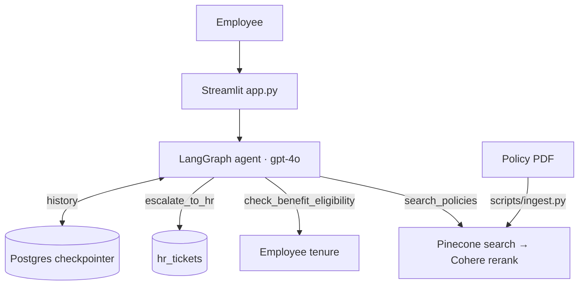

# Employee Onboarding Chatbot

An agentic RAG onboarding assistant for the (fictional) Umbrella Corporation. Employees log in, ask about company policies, benefits, and safety protocols, and get personalized, **cited** answers. A LangGraph agent decides when to search the policy documents, check the employee's tenure, or escalate to HR.

## Stack

| Layer | Technology | Description |
|---|---|---|
| UI | Streamlit | Streaming chat, in-process (no separate API) |
| Agent | LangGraph / LangChain, OpenAI `gpt-4o` | Agentic tool-calling loop |
| Retrieval | Pinecone, Cohere | Vector search with reranking |
| Data | Postgres, SQLAlchemy + Alembic | Employee/auth data and conversation history (LangGraph checkpointer) |

## Architecture



## Setup

```bash
uv sync
cp .env.example .env
```

## Run

```bash
uv run alembic upgrade head
uv run python -m scripts.ingest\
uv run python -m scripts.seed_employees
uv run streamlit run app.py
```

Log in with a seeded email (printed by the seed script) and the shared password
`Umbrella2026!`, then try:

- "What is the leave policy?"
- "Am I eligible for extended PTO?"
- "What are the lab safety protocols?"

## LangSmith tracing

To trace agent runs, set in `.env`:

```
LANGSMITH_TRACING=true
LANGSMITH_API_KEY=lsv2_...
LANGSMITH_PROJECT=employee-onboarding-chatbot
LANGSMITH_ENDPOINT=        # US: leave blank
                           # EU: `https://eu.api.smith.langchain.com`
                           # APAC: `https://apac.api.smith.langchain.com`
```
